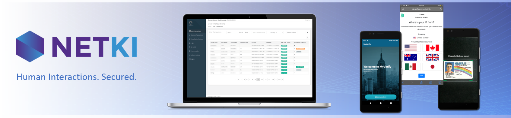

# Netki Technical Product Documentation

## Table of Contents

- [OnboardID](#onboardid)
- [OnboardID Solutions](#onboardid-solutions)
- [OnboardID API Access](#onboardid-api-access)
- [TransactID](#transactid)
- [Defi Sentinel](#defi-sentinel)

## OnboardID

Dramatically Reduce Onboarding Costs While Stopping Fraud

Deliver the fast and easy experience customers demand, while decreasing fraud risk.

OnboardID is the leading solution for both individual and corporate onboarding.

- Fully automated solution decreases onboarding costs up to 60%.
- Auto-validate up to 95% of new customer ID's.
- Branded mobile app validates ID's in less than a minute.
- Advanced biometrics and analysis detect fraud better than any other KYC solution.
- Intuitive dashboard interface gives compliance officers unmatched audit trail.

## OnboardID Solutions

Netki covers the most common range of devices and mechanisms for KYC/AML solutions. We have taken our cutting edge flagship application `MyVerify` and made those algorithms available as downloadable SDKs.

Our suite of products covers the following application strategies:

- Android SDK native in Java and Kotlin
- iOS SDK native in Objective-C and Swift
- React Native wrapper
- iframe based Web SDK
- API interface

## OnboardID SDKs

We offer a full featured SDK for OnboardID.  The SDK will provide your engineering team with the components necessary for you to send your users through a custom KYC onboarding flow of your design within your own mobile application or web portal.

After setting up an account with us we will send you onboarding information. It normally takes a few days to build around our SDK with the biggest consumption of time coming from the consumption of the data that we will send you. It is a lot of data to digest.  You may refer to the [API Access](#onboardid-api-access) to learn more about how our APIs work.

### OnboardID Android SDK

[OnboardID Android SDK](./onboard_id_android.md)

### OnboardID iOS SDK

[OnboardID iOS SDK](./onboard_id_ios.md)

## OnboardID API Access

Nearly all of our clients will interact with the API.  While not all clients will use more than one of the SDKs, it is important to plan ahead to integrate with the API.  Your data will return via callbacks. In addition to getting data via callbacks it is also best practices to routinely poll the API to check to see if new records have shown up. You will gather information this way on overall statistics regarding records that are in processing and can pull a transaction to see if data has been updated.  

For information regarding our API implementation, sign into the compliance dashboard and refer to the documentation found inside that portal.

## TransactID

Netki's TransactID allows Virtual Asset Providers (VASPs) to capture and transfer the information required by the "Travel Rule," and stay in compliance with FATF and local jurisdiction regulations.  TransactID uses open-source standards to enable a secure, encrypted, peer-to-peer exchange of identity information between parties prior to transactions.  It's the only Travel Rule compliance solution that's been in use since 2016.

- Works with custodial and non-custodial wallets
- Open standards solution avoids vendor lock in
- Leverages legally accepted digital ID standard (X.509)

## Defi Sentinel
The DeFi Sentinel system allows our clients to provide real time compliance at the time of the transaction including KYC/AML, wallet screening, transaction screening, securities and tax compliance. By enabling Sentinel DeFi protocols will be ale to meet the compliance requirements of institutions wishing to deploy capital into DeFi as well as emerging global regulations.  See [docs](./defi-sentinel.md) for integration steps.
