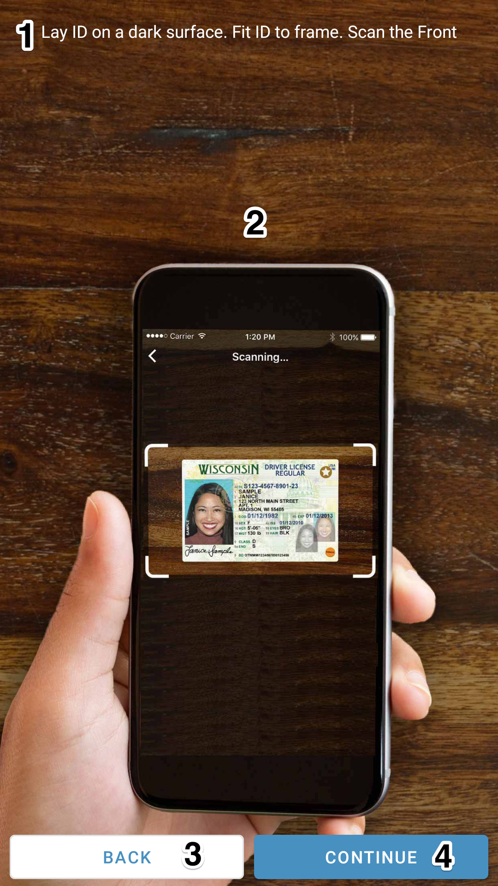
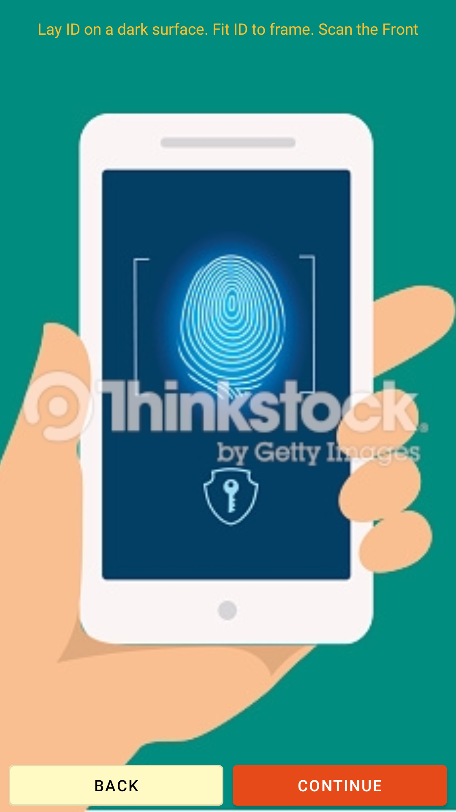
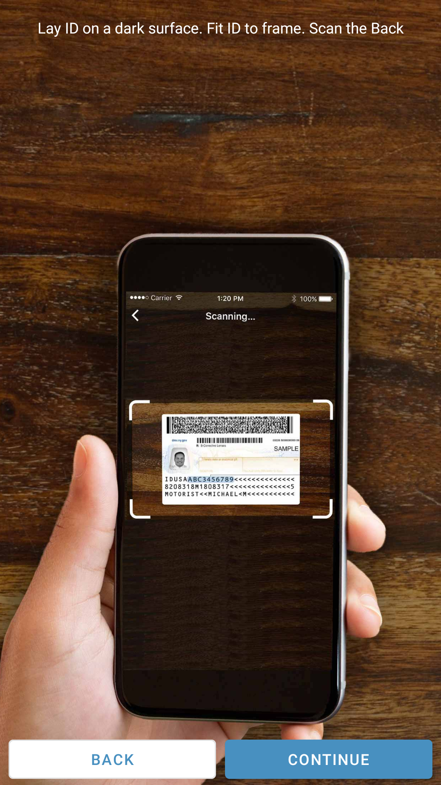
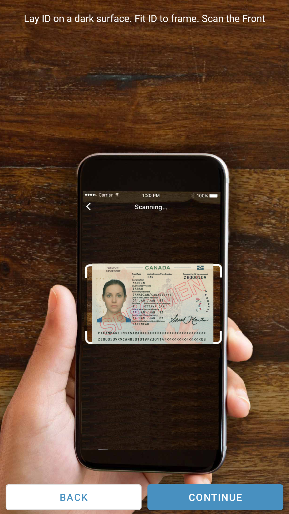
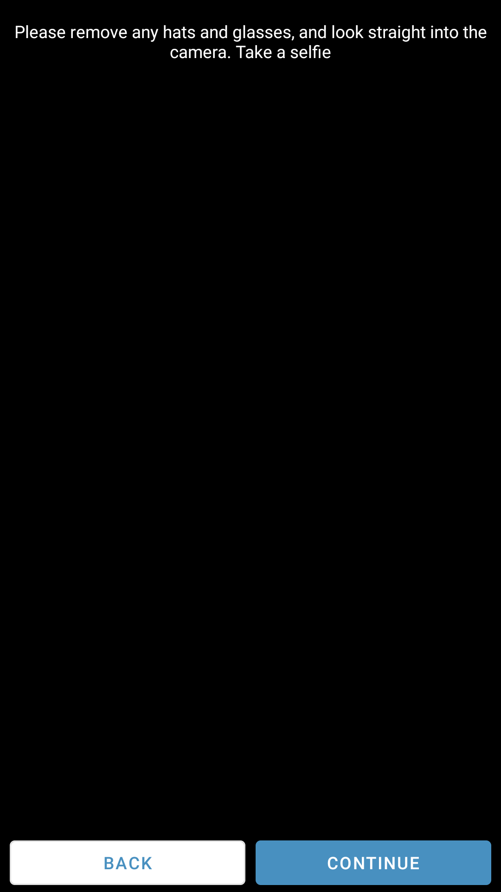
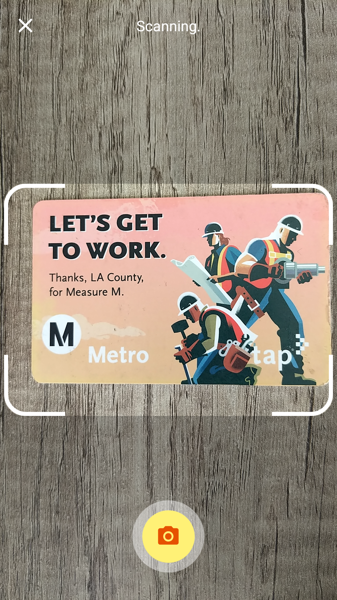
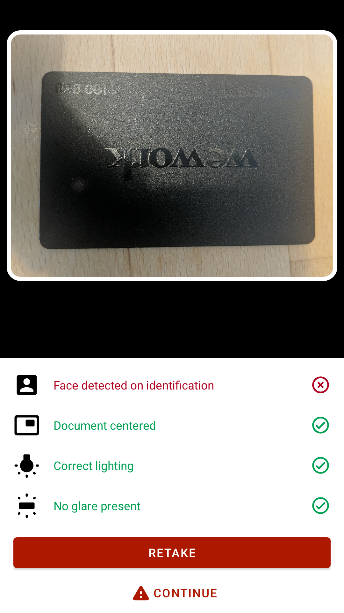
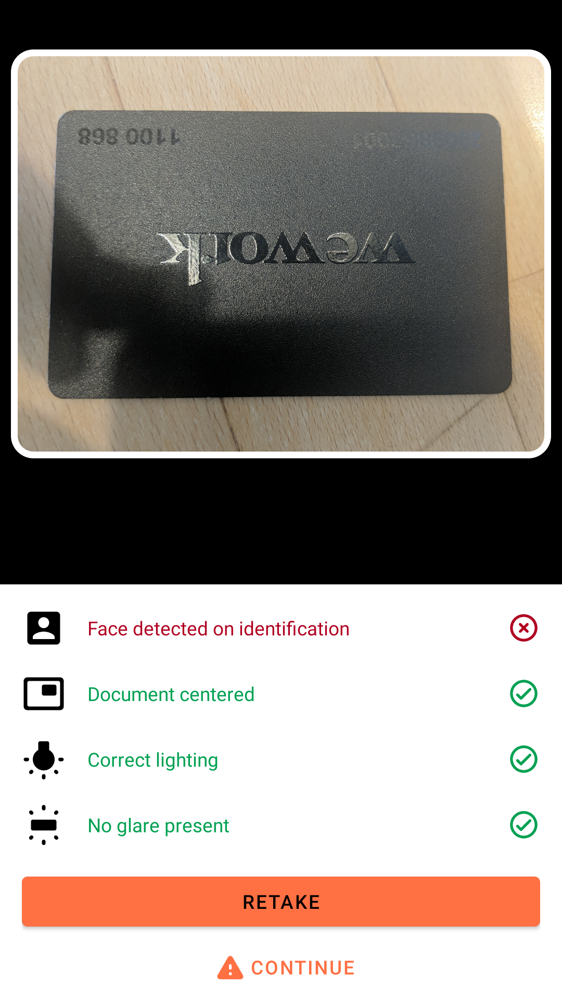

# Netki OnboardID Themed SDK - Android


Dramatically Reduce Onboarding Costs While Stopping Fraud.

## Table of Contents

- [Overview](#overview)
- [Front Identification Instructions Page](#front-identification-instructions-page)
- [Back Identification Instructions Page](#back-identification-instructions-page)
- [Front Passport Instructions Page](#front-passport-instructions-page)
- [Selfie Instructions Page](#selfie-instructions-page)
- [Image Capture Screen](#image-capture-screen)


## Overview

The NetkiSDK provide the ability for the clients implementing it to configure and personalize some of the UI elements to make it fit better with their application and show a more natural transition between their app and the SDK.
This document shows what elements can be customized and the way the they are customized.


The colors that all the elements follow are the next ones:

```html
<color name="netki_primary_color">#483090</color>
<color name="netki_accent_color">#4890C0</color>
<color name="netki_text_accent_elements_color">#FFFFFF</color>
<color name="netki_background_color">#FFFFFF</color>
<color name="netki_error_color">#B00020</color>
<color name="netki_success_color">#00a152</color>
<color name="netki_text_instructions_color">#FFFFFF</color>
<color name="netki_secondary_button_color">#FFFFFF</color>
<color name="netki_camera_button_color">#FFFFFF</color>
```

In order to change the color of the elements the client needs to override these previous colors with their own colors defined in their `colors.xml` file
Below I show the screens and the correspondent color for each one.

## Front Identification Instructions Page




<br />

- **1 Instruction Text**

    **Key**: `netki_text_instructions_color`

<br />

- **2 Instructions Background Image**

This is a full image that the client can replace with their own. To replace it the client needs to add an image with name `front_instructions_id.jpg`, in the correspondent `drawable` folder for each resolution.

The client can also add one single resource in the `drawable` folder. If this strategy is chosen the image should be a high resolution image so it can scale properly to all the resolutions

* **3 Back Button**
    * Background color: `netki_secondary_button_color`
    * Text color: `netki_accent_color`
    * Continue Button:
    * Background color: `netki_accent_color`
    * Text color: `netki_text_accent_elements_color`

<br /><br /><br /><br /><br />

An example of a full customized page for front instructions is:




## Back Identification Instructions Page

Similar to the front instructional page we provide a way to set your own own instructional page for the capture of the back image.

This is a full image that the client can replace with their own. To replace it the client needs to add an image and name it `back_instructions_id.jpg`, and place it in the correspondent `drawable` folder for each resolution. The client can also just add one single resource in the `drawable` folder. This image must be high resolution in the same way that it will be for the front.  




## Front Passport Instructions Page

This follows the same instructions as the previous 2 instruction pages.

Add an image with name `front_instructions_passport.jpg` in the correspondent `drawable` folder for each resolution. The client can also just add one single resource in the `drawable` folder.



## Selfie Instructions Page

This follows the same instructions as the previous 3 instruction pages.

Add an image with name `selfie_instructions_id.jpg` in the correspondent `drawable` folder for each resolution. The client can also just add one single resource in the `drawable` folder.




## Image Capture Screen

This is a dynamic screen so many of the features are not able to be changed.  Our machine learning computer vision algorithms are working on this page and guiding the user in a way that will facilitate a good capture of their ID.  

Below are the elements which can be altered

**Picture Capture Button**

- The color of the button is defined with: `netki_camera_button_color`
- The color of the icon is defined with: `netki_accent_color`





## Image Review Screen

The review screens are controlled by the same theme settings as what is above.  The button and accent button colors will control these features. 



