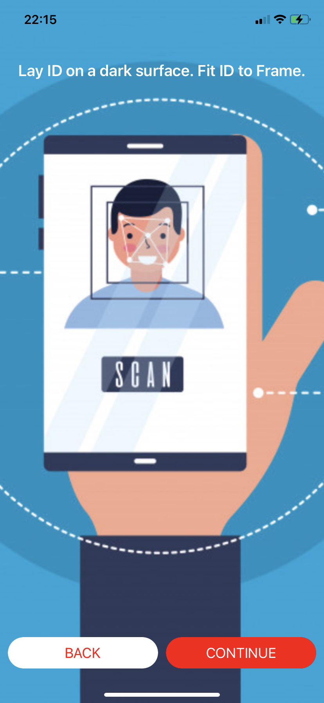
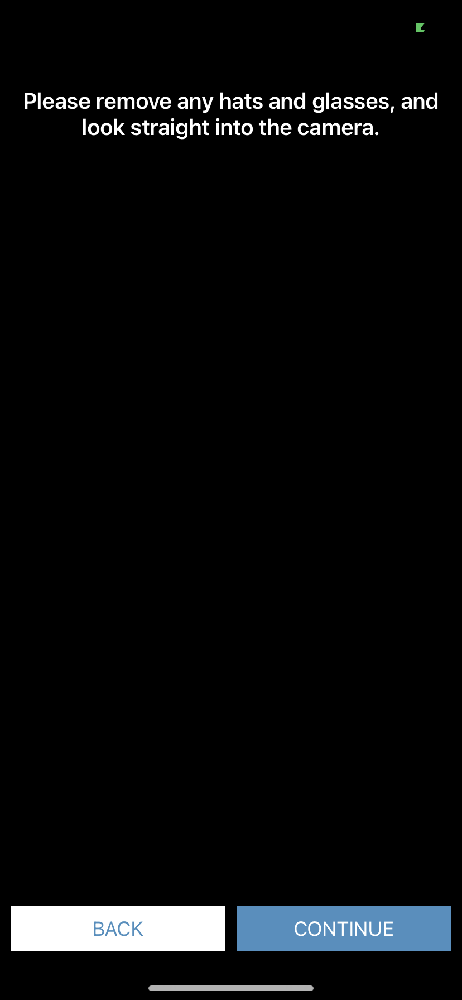
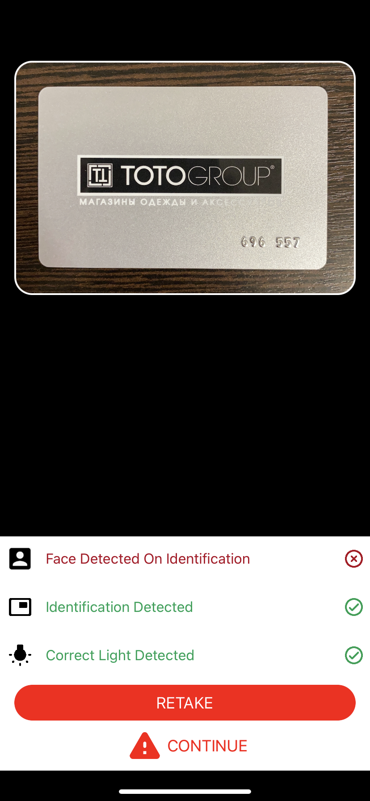

# Netki OnboardID Themed SDK - iOS

Dramatically Reduce Onboarding Costs While Stopping Fraud.

## Table of Contents

- [Front Identification Instructions Page](#front-identification-instructions-page)
- [Back Identification Instructions Page](#back-identification-instructions-page)
- [Selfie Instructions Page](#selfie-instructions-page)
- [Image Review Screen](#image-review-screen)
- [Buttons ](#buttons)

Import NetkiSDK framework:

    #import <netkisdk_ios/netkisdk_ios.h>

Refer to the `NTKAppThemeProvider` object.

Description:

```objectivec

@interface NTKAppThemeProvider : NSObject

+ (instancetype)sharedInstance;

@property (strong, nonatomic) UIImage * passportInstructionPageImage;
@property (strong, nonatomic) UIImage * passportLastPageInstructionPageImage;
@property (strong, nonatomic) UIImage * driverLicenseFrontInstructionPageImage;
@property (strong, nonatomic) UIImage * driverLicenseBackInstructionPageImage;
@property (strong, nonatomic) UIImage * govermentIdFrontInstructionPageImage;
@property (strong, nonatomic) UIImage * govermentIdBackInstructionPageImage;
@property (strong, nonatomic) UIImage * selfieInstructionPageImage;
@property (strong, nonatomic) UIColor * primaryButtonBackgroundColor;
@property (strong, nonatomic) UIColor * primaryButtonTextColor;
@property (strong, nonatomic) UIColor * secondaryButtonBackgroundColor;
@property (strong, nonatomic) UIColor * secondaryButtonTextColor;
@property (assign, nonatomic) CGFloat buttonsCornerRadius;
@property (strong, nonatomic) UIColor *successColor;
@property (strong, nonatomic) UIColor *errorColor;

@end
```

## Front Identification Instructions Page


- **1 Background Image**

- **2 Secondary  Button**
    * Background color: `secondaryButtonBackgroundColor`
    * Text Color: `secondaryButtonTextColor`
    
- **3 Primary  Button**
    * Background color:  `primaryButtonBackgroundColor`
    * Text Color: `primaryButtonTextColor` 


To configure the front instructions page background image you can set   `govermentIdFrontInstructionPageImage`, `driverLicenseFrontInstructionPageImage`, `passportInstructionPageImage` properties in the  `NTKAppThemeProvider`.

See the examples below:

```objectivec
NTKAppThemeProvider.sharedInstance.govermentIdFrontInstructionPageImage = [UIImage imageNamed:@"example_front_background"];
```

```objectivec
NTKAppThemeProvider.sharedInstance.driverLicenseFrontInstructionPageImage = [UIImage imageNamed:@"example_front_background"];
```

```objectivec
NTKAppThemeProvider.sharedInstance.passportInstructionPageImage = [UIImage imageNamed:@"example_front_background"];
```

Here is an example of a full customized page for front instructions is:




## Back Identification Instructions Page

Similar to the front instructions page we provide a way to set your own instructions page for the document back capture.

To configure the back ID instructions page background you can set   `govermentIdBackInstructionPageImage`, `driverLicenseBackInstructionPageImage`, `passportLastPageInstructionPageImage` properties in the  `NTKAppThemeProvider`.

See the example below:

```objectivec
NTKAppThemeProvider.sharedInstance.govermentIdBackInstructionPageImage = [UIImage imageNamed:@"example_back_background"];
```

```objectivec
NTKAppThemeProvider.sharedInstance.driverLicenseBackInstructionPageImage = [UIImage imageNamed:@"example_back_background"];
```

```objectivec
NTKAppThemeProvider.sharedInstance.passportLastPageInstructionPageImage = [UIImage imageNamed:@"example_back_background"];
```


## Selfie Instructions Page

Follow the same instructions as the previous instruction pages.

To configure the selfie instructions page background you can set   `selfieInstructionPageImage`  property in the  `NTKAppThemeProvider`.

See the examples below:

```objectivec
NTKAppThemeProvider.sharedInstance.selfieInstructionPageImage = [UIImage imageNamed:@"example_selfie_background"];
```



## Image Review Screen

Review screens controlled by the same theme settings as what is above.



## Buttons

**Buttons background**

To configure the background for the buttons you can set   `primaryButtonBackgroundColor` and   `secondaryButtonBackgroundColor` properties in the  `NTKAppThemeProvider`.

See the examples below:

```objectivec
NTKAppThemeProvider.sharedInstance.primaryButtonBackgroundColor = UIColor.redColor;
```

```objectivec
NTKAppThemeProvider.sharedInstance.secondaryButtonBackgroundColor = UIColor.whiteColor;
```

**Buttons text color**

To configure the button title color you can set   `primaryButtonTextColor` and   `secondaryButtonTextColor` properties in the  `NTKAppThemeProvider`.

See the examples below:

```objectivec
NTKAppThemeProvider.sharedInstance.primaryButtonTextColor = UIColor.whiteColor;
```

```objectivec
NTKAppThemeProvider.sharedInstance.secondaryButtonTextColor = UIColor.redColor;
```

**Buttons corner radius**

To configure the button corner radius you can set the  `buttonsCornerRadius` property in the  `NTKAppThemeProvider`, by default this value is set to 0.0f, you can set a value between 0.0f and 20.0f.

See the example below:

```objectivec
NTKAppThemeProvider.sharedInstance.buttonsCornerRadius = 20.0f;
```
