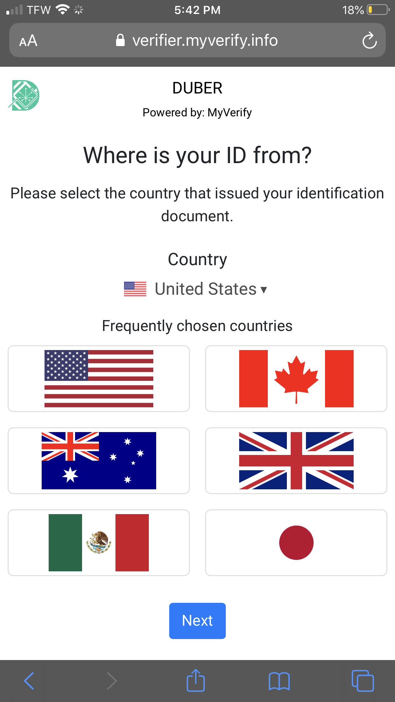
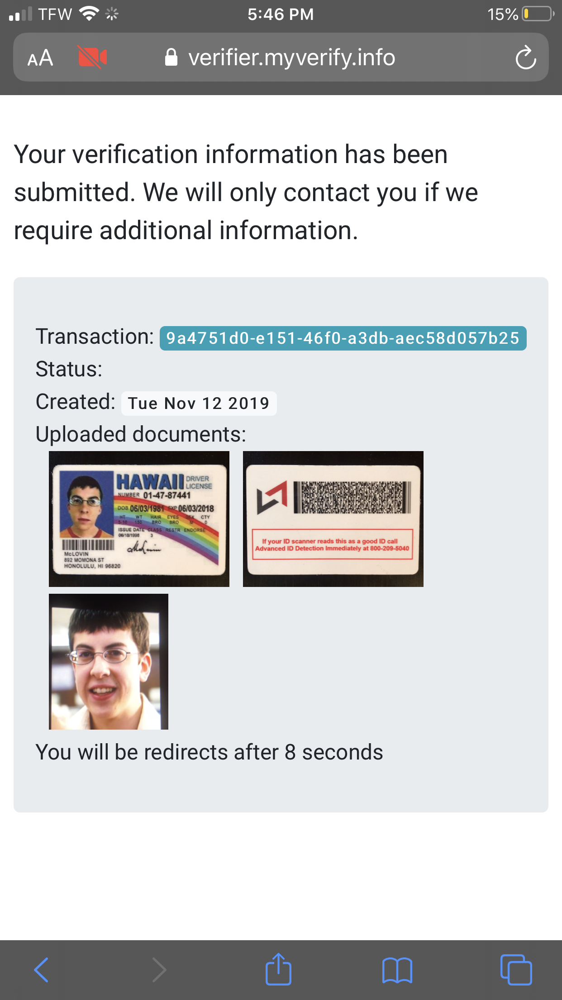
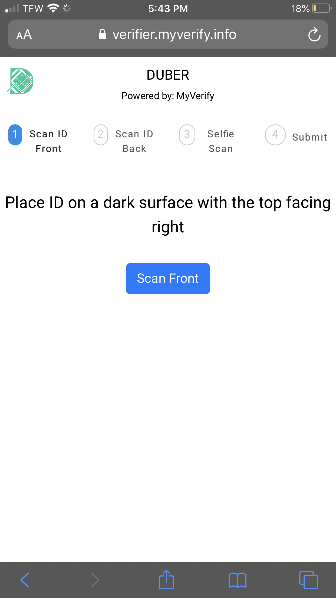
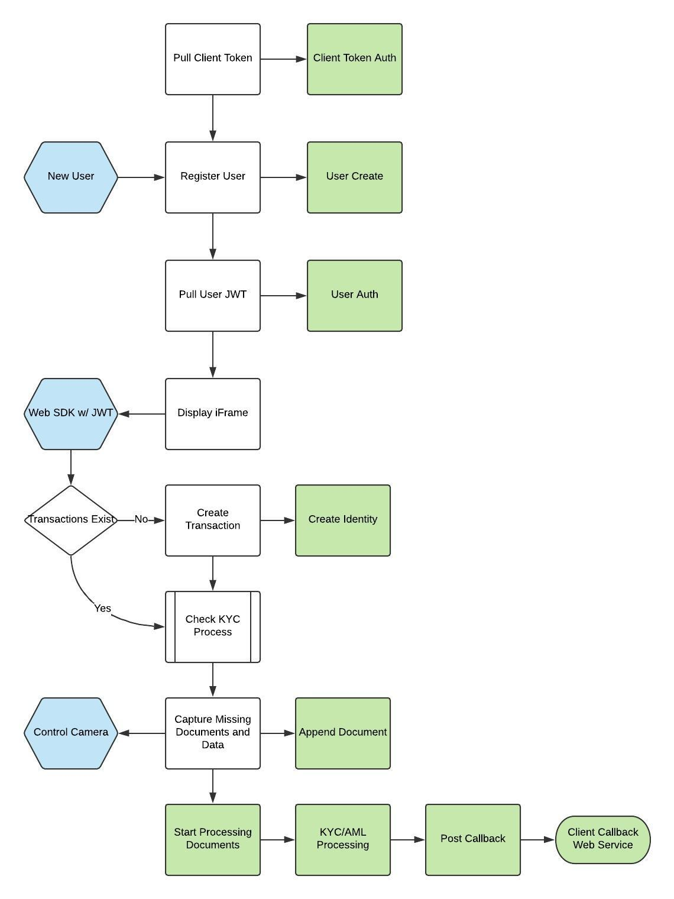
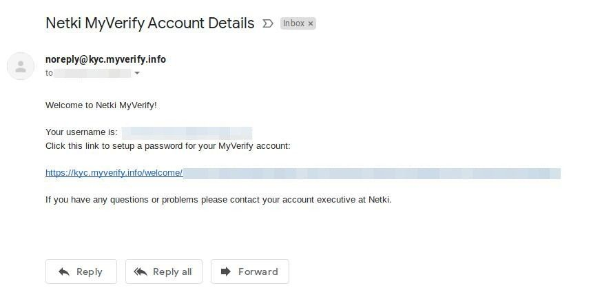

# Web SDK / JavaScript Widget

## Embedded KYC and Onboarding Widget

Netki is a leader in mobile application development and machine learning algorithms.  We have taken many of the best algorithms and tools that are found in our MyVerify app and recompiled them for distribution on mobile browsers such as iOS Safari and Android Chrome. There are a few pros and cons by running in a browser.

Pros:

+ No application download
+ Seamless integration into a client's portal
+ Coordination between desktop and mobile experiences
+ Broad deployment audience (browsers are on nearly all major phones)
+ Standardized security schemes

Cons:

+ Slightly less crisp user experience (native apps are prettier)
+ Some missing or degraded algorithms
+ Different risk profile with chain of custody
+ No direct control of the cameras


## Embedded User Experience

Below are the screens that your users will experience once they start the KYC flow.

First they will be asked to select their country of origin.



Then they will be asked what document type.




The messaging on the instruction page primes the user on how to take a good picture. It is important for them to lay the ID flat on a clean flat dark horizontal surface.


Our machine learning algorithms will guide the user through taking a good picture by providing feedback during the flow.


We will also snap a picture of a selfie. These is usually a better picture because most people know how to take a selfie.




## User Workflow

Sometimes it is helpful to see things laid out in a workflow. Below is a flow diagram that walks through the various pieces of the onboarding flow.  The goal is for your user to have very little inputs.  Snap a picture of their ID and then post processing extracts all the data.  




## Onboarding Steps

### Register With Netki

Contact Netki business development at client-onboard@netki.com  

Our team will contact you and consult with you on the best way to approach your KYC and compliance requirements.


## Pull Your Tokens

Once you are registered you will receive an email to set up your account.  You will be asked to set a password.



Retain your username/email and password.  This will be used to access our dashboard and the API.

```
curl -X POST \
  https://kyc.myverify.info/api/client-token-auth/ \
  -H 'Content-Type: application/json; \
  -d '{"username":"USERNAME","password":"PASSWORD"}'

{"token":"CLIENT_TOKEN"}
```

This will fetch your business' client token.  This token is used to START the KYC flow with the widget. You will append this data onto the initialization URL when you embed the iframe.

This represents your account and while it is possible to use widget with only this token you will lose the functionality of being able to transport you user across to other devices.


## Set Your Thank You Page

The user will be redirected back to your site on completion. We will need the URL for your Thank You landing page. When onboarding the questionnaire will have a space to fill in this URL.


## Register Your User With Netki

Once you have pulled your non-changing client token you can store this token in your environment. Use the client token to create a user record with Netki.  This user record will provide the credentials that are used to push the transaction data under that person’s account.


### Create A User

There are 4 required fields.

If you want to fill in the fields some way that is unique to you then that is fine. We sometimes see clients use the email field by adding their unique user UUID and their domain. Email is the same as username in these cases and will be used in the next call to pull in that user’s JWT.

```
curl -X POST \
  https://kyc.myverify.info/api/users/ \
  -H 'Accept: */*' \
  -H 'Authorization: Token {{TOKEN}}' \
  -H 'Content-Type: application/json; charset=utf-8' \
  -d '{
	"first_name": "JOHNNY",
	"last_name": "POST",
	"email": "UNIQUE@EMAIL.COM",
	"password": "18char_STRONG_PASSWORD!"
}'
```

### Pull User JWT

```bash
curl -X POST \
  https://kyc.myverify.info/api/token-auth/ \
  -H 'Content-Type: application/json' \
  -d '{"username":"USERNAME@DOMAIN.COM","password":"18char_STRONG_PASSWORD!"}'
```

## Embed The Iframe

**NOTE**: Currently we may attempt to break the iframe. On mobile devices this will not work. A work around is to send the user directly to the link that would be the source of the iframe.

On your signup page you will drop this embedded code with your client token. This will initialize and start the KYC/onboarding flow.

On mobile devices we “may” break the iframe and surface the application at the top level so that we can fill the screen with it.  This will give us far more control.  

Upon completion of the KYC flow the user will be redirected back out to the url of your choice. If they were on a session cookie or had already logged into your site they should return back with the same level of authentication.

    `<iframe src="WEBSDK_BASE_URL/?client_token=CLIENT_TOKEN&user_token=USER_JWT&client_guid=YOUR_GUID" ></iframe>`

NOTE: this iframe needs all the display real estate that you can give it.  Do not attempt to surround it with much chrome or padding.  Leave footers and headers off when possible.  You can even redirect the user to the link itself if your users will not worry about the domain switch.

NOTE: this iframe needs all the display real estate that you can give it.  Do not attempt to surround it with much chrome or padding.  Leave footers and headers off when possible.  You can even redirect the user to the link itself if your users will not worry about the domain switch.

## URL Settings


### WEBSDK_BASE_URL

    Production: https://verifier.myverify.info
    Development: https://dev-verifier.myverify.info

### CLIENT_TOKEN

    /api/client-token-auth/

### USER_JWT

    /api/token-auth/

## Callback Data

Once the user has completed the onboarding transaction flow you will receive a callback containing all the data that the user submitted and all the data that we collected from the extraction and verification process.

When Netki onboards your business we ask for information regarding the details of the endpoint on your server that will receive the callback data.  

Our service will post complete callback data every time we update the “state” or the processing status of the record.  In some cases the data will not go through in one shot and will have to be manually reviewed. In these cases your data will be on hold.  Your server will receive a callback with it on hold but then will also get a callback again when it moves to the next state.

More information regarding callback states and payload can be found in the compliance dashboard.
